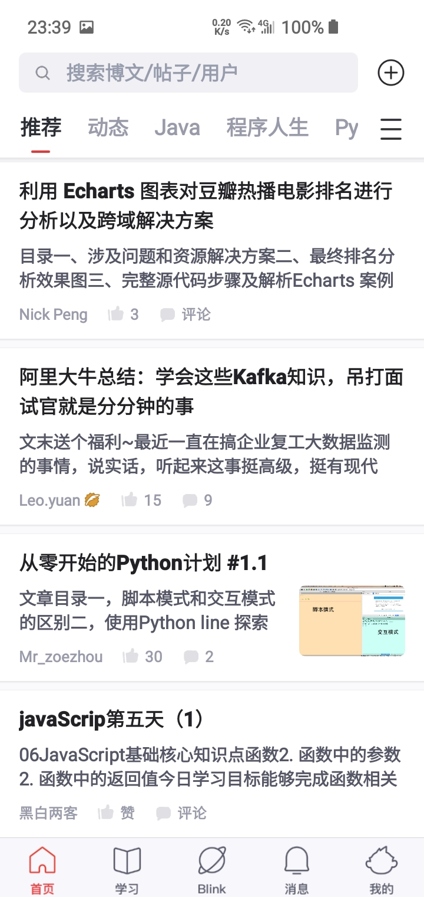

# 首页详情

## 页面主要内容
+ 搜索帖子/用户/标题
+ 最近发布的内容
## style 
| name                   | value  |
| :--------------------- | :----: |
| navigationBarTitleText |  首页  |
| enablePullDownRefresh  |  true  |
| navigationStyle        | custom |

+ Tips: *组件提供的搜索框没有合适的，只能自己写。*
